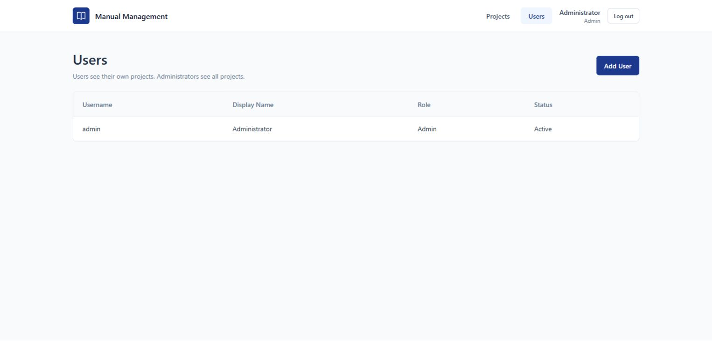

# Login and Project ownership — implementation report

Verified 7 October 2026. Updated the existing application in response to the user's request: remove All Manuals, add Login/user storage, show each user only Projects they create, let admin see all, and delete the old test fixtures.

## Result and usage

Open [Login](http://127.0.0.1:5173/login). Initial username: **admin**. The generated initial password is stored only as `INITIAL_ADMIN_PASSWORD` in the ignored local `backend/.env`; it was not printed in logs or added to frontend source/build. The account is already provisioned. The database stores a password hash, never the plaintext password.

After Login, **Users → Add User** creates a BA account (default USER) or another ADMIN. Users create their own Projects. There is no public registration. A USER sees only owned Projects; ADMIN sees every Project. Ownership is assigned from the authenticated session, not request fields. created_by/uploaded_by/published_by now use the actual username.

All Manuals is gone from navigation and `/manuals` redirects to `/projects`. Manual Detail returns to its Project. Existing Manual APIs remain for authenticated clients, with Project-based access checks. Revisions, MinIO storage, PDF validation, checksums, cleanup and publish/current-pointer transactions were retained.



## Database and explicit migration

[003_users_and_ownership.sql](../backend/migrations/003_users_and_ownership.sql) was explicitly applied twice successfully. It is transactional, has lock/statement timeouts and never runs at startup. The existing PostgreSQL database **manual** is reused; no separate database was created.

| Table | Added structure |
| --- | --- |
| users | id BIGSERIAL PK, username VARCHAR(100) UNIQUE NOT NULL, display_name VARCHAR(255), password_hash VARCHAR(255), role VARCHAR(20) CHECK USER/ADMIN default USER, is_active BOOLEAN default true, failed_login_attempts INTEGER default 0, locked_until TIMESTAMPTZ, created_at TIMESTAMPTZ |
| user_sessions | token_hash VARCHAR(64) PK, user_id BIGINT FK users(id) ON DELETE CASCADE, expires_at TIMESTAMPTZ, created_at TIMESTAMPTZ; indexes on user_id/expires_at |
| projects | owner_user_id BIGINT nullable, fk_projects_owner → users(id), idx_projects_owner_user_id |

No user/project ownership fields were added to Manuals or Revisions; ownership resolves through the existing hierarchy. Existing unassigned Projects, if present in another environment, are administrator-only. Newly created Projects always receive the logged-in user's ID.

## Authorized test-data removal

The user explicitly said to delete the previous test Projects. Before deletion, exact IDs, codes and object keys were checked against the previously captured fixtures. Only **LEGACY** and **PRJ-PLATING**, their **2 Manuals**, **4 Revisions** and **4 MinIO PDFs** were removed. A transaction cleared current pointers before deleting those specific records. MinIO deletion used only those exact stored keys. No tables were dropped or truncated.

The manifest is [deleted-test-fixtures.json](deleted-test-fixtures.json). Old fixture objects were subsequently checked and confirmed absent. New live-auth verification fixtures were also removed through guarded, scoped cleanup. Final live row counts: **users 1 (admin), projects 0, manuals 0, manual_revisions 0**. The application is clean for real data entry.

## Authentication and access enforcement

Passwords use salted scrypt N=131072, r=8, p=1, following the [OWASP password-storage guidance](https://cheatsheetseries.owasp.org/cheatsheets/Password_Storage_Cheat_Sheet.html). Two concurrent password derivations per backend process are allowed; excess work returns 429 without reducing hash strength. Five failed logins lock a known account for 15 minutes. Invalid credentials use one generic message.

Login creates a random opaque session, stores only its SHA-256 hash in PostgreSQL, and sends an HttpOnly/SameSite=Strict cookie. Sessions default to eight hours. Logout deletes the stored session and clears the cookie. A CSRF header protects mutations; its token is returned by login/me and held only in frontend memory. Login rejects foreign browser origins. Protected API responses are no-store. Cookie behavior follows the [OWASP session guidance](https://cheatsheetseries.owasp.org/cheatsheets/Session_Management_Cheat_Sheet.html).

All Project, Manual and Revision endpoints check authentication and ownership. This includes lists, direct metadata URLs, new Manuals, uploads, current revision, history, publish, preview and download. Other users receive 404 for inaccessible resources; unauthenticated clients receive 401. Admin-only user operations return 403 to ordinary users. API_TOKEN remains optional gateway protection and does not bypass Login.

## API additions

| Endpoint | Behavior |
| --- | --- |
| POST /api/auth/login | Authenticate and set session cookie; return safe user metadata and CSRF token |
| GET /api/auth/me | Read current session identity/token |
| POST /api/auth/logout | Revoke session and clear cookie |
| GET /api/users | Admin-only safe account list |
| POST /api/users | Admin-only account creation; USER/ADMIN, password minimum 12 characters |

Project list/detail/manual routes and all existing Manual/Revision routes are protected. Project creation assigns owner_user_id automatically; Project update cannot transfer ownership. Normal users must create Manuals within an accessible Project. Only admins retain the existing unassigned LEGACY creation fallback.

## Files

Created: `backend/app/auth.py`, `backend/app/models/user.py`, `backend/app/schemas/user.py`, `backend/app/routers/auth.py`, `backend/app/routers/users.py`, `backend/migrations/003_users_and_ownership.sql`, `backend/scripts/create_admin.py`, `backend/scripts/smoke_auth.py`, `backend/tests/test_auth.py`; `frontend/src/api/auth.ts`, `frontend/src/types/user.ts`, `frontend/src/pages/LoginPage.tsx`, `frontend/src/pages/UsersPage.tsx`, `frontend/src/test/auth.test.tsx`; this report, deletion manifest and `docs/login.png` / `docs/admin-users.png`.

Modified: Backend config/main, Project model/schema/router, existing Manual and Revision routers for authorization/audit identity, migration runner/schema inspector, `.env.example`, test conftest; Frontend App/shared API client, Project type, Manual Detail and Project tests; `.gitignore`, README and ignored local Backend `.env`. Existing storage service, Revision model/schema, PDF processing, revision UI/history and publish transaction were reused. No dependencies or additional infrastructure were added.

## Verification

| Check | Result |
| --- | --- |
| Backend pytest | **50 passed / 0 failed**; existing Starlette/httpx deprecation warning |
| Frontend Vitest | **20 passed / 0 failed** |
| TypeScript | **PASS** |
| Production build | **PASS** |
| npm audit | **0 vulnerabilities** |
| PostgreSQL | **PASS** — migration/rerun, user tables, ownership FK/index, admin account and final counts |
| MinIO / real HTTP | **PASS** — authenticated uploads, signed preview/download bytes/checksums, publish/archive/current pointer |
| Ownership isolation | **PASS** — two real users each saw one own Project; admin saw both; direct descendant access denied |
| Browser | **PASS for Login, admin navigation/Users/Add User dialog and Logout** |
| Secret scan | **PASS** — configured PostgreSQL/MinIO/admin secrets absent from frontend source and built assets |

All previous 43 backend/16 frontend tests remain passing. Existing backend business tests use a persisted administrator fixture; separate auth tests exercise actual Login/session/CSRF and access denial. Existing UI tests wait for the asynchronous session check. No business assertions were removed or weakened. Independent review identified hashing concurrency and CLI validation redaction issues; both were reproduced by tests, fixed, and re-reviewed successfully. A cache middleware request-stream regression was corrected with pure ASGI send wrapping; the original chunked size-limit test remains passing.

Run current live verification from backend with PYTHONPATH=. and the API running:

```powershell
..\.venv\Scripts\python.exe scripts/smoke_auth.py
```

It creates uniquely labelled temporary users/Projects/documents, performs the full access/storage flow, and removes only those newly created IDs and keys in guarded cleanup. Old Phase 1/2 smoke scripts/reports are historical after the requested fixture deletion.

## Startup and actual limitations

Backend: from `backend`, run `..\.venv\Scripts\python.exe -m uvicorn app.main:app --host 127.0.0.1 --port 8000`.

Frontend: from `frontend`, run `npm.cmd run dev`. Both services are currently running. The browser was left logged out at Login.

For a new environment, explicitly run migration 003 after previous migrations, then `scripts/create_admin.py --username admin` (private password prompt), or `--from-env` with INITIAL_ADMIN_PASSWORD configured. The CLI never overwrites an existing administrator and sanitizes validation errors.

Deployment needs HTTPS with `COOKIE_SECURE=true`; local HTTP uses false. Existing presigned URLs are bearer access lasting up to ten minutes and do not become invalid immediately on Logout. Full browser PDF selection still has the previously documented Edge extension file-access limitation; real HTTP uploads and frontend upload tests pass. No SSO, password-reset UI or ownership-sharing workflow was added.
