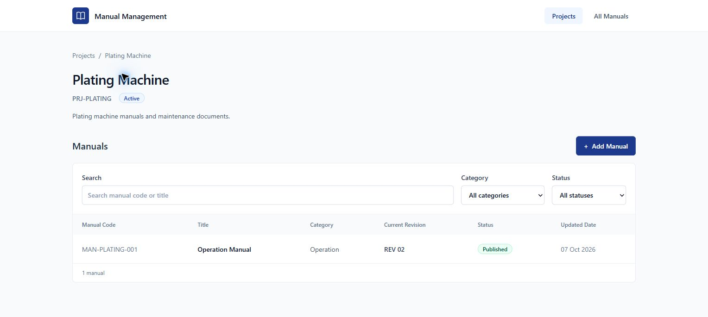

# Manual Management — Project Management implementation report

Verified 7 October 2026. Incremental enhancement of the existing application; no rebuild or architecture replacement.

## 1. Inspection findings

Before changes, all **32 backend tests and 10 frontend tests** passed. TypeScript, production build and full npm audit passed. Live PostgreSQL contained one retained manual and two revisions; `projects` did not exist. The existing global unique manual-code constraint, revision uniqueness, publication guard, foreign keys and indexes were inspected. Both legacy objects were retrieved and their hashes recorded in [project-baseline.json](project-baseline.json).

Reused the existing Manual/Revision models, manual creation/list validation, PDF validation, SHA-256 handling, immutable uploads, upload failure cleanup, current-revision pointer, row-lock publication transaction, preview/download endpoints and MinIO service. The revision model, schemas, router and storage service were not rewritten. Frontend reuse includes Dialog, ManualForm, UploadRevisionModal, RevisionHistory, StatusBadge, PdfPreview and the existing fetch client. The manual filters/table were extracted once into ManualsList for both All Manuals and Project Detail. DEFAULT_ACTOR and trusted-gateway integration are unchanged.

## 2. Files created

| Area | Files |
| --- | --- |
| Backend | `backend/app/models/project.py`, `backend/app/schemas/project.py`, `backend/app/routers/projects.py` |
| Migration | `backend/migrations/002_projects.sql` |
| Live verification | `backend/scripts/smoke_projects.py` |
| Frontend pages | `frontend/src/pages/ProjectsPage.tsx`, `frontend/src/pages/ProjectDetailPage.tsx` |
| Frontend shared components | `frontend/src/components/ProjectForm.tsx`, `frontend/src/components/ManualsList.tsx` |
| Frontend API/types | `frontend/src/api/projects.ts`, `frontend/src/types/project.ts` |
| Tests | `backend/tests/test_projects.py`, `backend/tests/test_project_storage.py`, `frontend/src/test/projects.test.tsx` |
| Evidence/documentation | `docs/project-baseline.json`, `docs/project-detail.png`, `docs/superpowers/plans/2026-10-07-project-management.md`, this report |

An ignored `backend/.project-smoke-result.json` records live fixture IDs, object keys and checks. No new dependencies or infrastructure were added.

## 3. Files modified

| File | Required integration |
| --- | --- |
| `backend/app/main.py` | Register Projects routes; allow PUT through CORS |
| `backend/app/models/manual.py` | Project FK, select-in relationship and project identity properties |
| `backend/app/schemas/manual.py` | Optional creation project ID; project identity in read responses |
| `backend/app/routers/manuals.py` | Share existing create/list behavior, optional project filter, LEGACY compatibility and new upload path prefix |
| `backend/scripts/migrate.py` | Explicit migration filename selection; default original migration preserved |
| `backend/scripts/inspect_schema.py` | Read-only inspection includes projects and row counts |
| `backend/tests/test_revisions.py` | Two new-upload path expectations gain LEGACY prefix; existing business assertions retained |
| `frontend/src/App.tsx` | Projects routes/navigation; root redirects to Projects; Manual routes preserved |
| `frontend/src/api/manuals.ts` | Export existing request helper; optional project-scoped create URL |
| `frontend/src/types/manual.ts` | Project identity fields |
| `frontend/src/pages/ManualsPage.tsx` | Use extracted shared manual filters/table |
| `frontend/src/pages/ManualDetailPage.tsx` | Add Project context and linked breadcrumb |
| `frontend/src/components/ManualForm.tsx` | Optional read-only Project context and scoped create request |
| `frontend/src/components/UploadRevisionModal.tsx` | Read-only Project context; upload logic preserved |
| `frontend/src/test/workflows.test.tsx` | Existing mock manual includes Project identity |
| `.gitignore`, `README.md` | Ignore smoke result; describe Project workflow, explicit migration, API, storage and startup |

## 4. Database migration

[002_projects.sql](../backend/migrations/002_projects.sql) was explicitly applied and successfully rerun before implementation and after the live Project workflow. It is transactional, uses a 5-second lock timeout and 30-second statement timeout, and never runs at startup.

Exact new table definition:

```sql
CREATE TABLE IF NOT EXISTS public.projects (
    id BIGSERIAL PRIMARY KEY,
    project_code VARCHAR(100) NOT NULL,
    project_name VARCHAR(255) NOT NULL,
    description TEXT,
    status VARCHAR(20) NOT NULL DEFAULT 'ACTIVE',
    created_by VARCHAR(100) NOT NULL,
    created_at TIMESTAMPTZ NOT NULL DEFAULT CURRENT_TIMESTAMP,
    updated_at TIMESTAMPTZ NOT NULL DEFAULT CURRENT_TIMESTAMP,
    CONSTRAINT uq_projects_project_code UNIQUE (project_code),
    CONSTRAINT chk_projects_status CHECK (status IN ('ACTIVE', 'ARCHIVED'))
);
```

The only new Manual column is `project_id BIGINT NOT NULL`. The migration first adds it as nullable, ensures `LEGACY` exists using ON CONFLICT, assigns only manuals with NULL project_id, then enforces NOT NULL. The system project has name **Legacy / Unassigned Manuals**, description **Manuals created before Project Management was introduced.**, creator **SYSTEM**, and status ACTIVE.

The resulting new FK/index are:

```sql
ALTER TABLE public.manuals ADD CONSTRAINT fk_manuals_project
    FOREIGN KEY (project_id) REFERENCES public.projects(id);
CREATE INDEX idx_manuals_project_id ON public.manuals(project_id);
```

The actual migration checks for equivalent FK/index definitions before creating them. The project-code unique constraint supplies its own unique index. Existing global `uq_manuals_manual_code` remains unchanged. No project_id was added to manual_revisions. No tables/data/files were dropped, truncated, deleted or moved.

After migration and verification: **2 projects, 2 manuals, 4 revisions**, no NULL project IDs. Legacy manual ID 1 still points to revision ID 2; original revision statuses, object keys, checksums and bytes match the baseline. The new labelled fixture is Project ID 3 / Manual ID 3 / revision IDs 3 and 4. Gaps in IDs arise from repeat migration/duplicate checks and are normal sequence behavior.

## 5. API

New endpoints:

| Method | Endpoint | Behavior |
| --- | --- | --- |
| GET | `/api/projects` | Optional search/status; manual counts from one grouped query |
| POST | `/api/projects` | Trimmed required code/name; ACTIVE; 201 or duplicate 409 |
| GET | `/api/projects/{project_id}` | Project summary/count; missing 404 |
| PUT | `/api/projects/{project_id}` | Update provided code/name/description/status; uniqueness and status validation |
| GET | `/api/projects/{project_id}/manuals` | Scoped existing manual responses; search/category/status filters |
| POST | `/api/projects/{project_id}/manuals` | Existing manual creation validation; Project comes from URL; missing Project 404 |

Modified existing endpoints: GET `/api/manuals` accepts optional project_id; POST `/api/manuals` accepts optional project_id and defaults to LEGACY when omitted. Manual metadata responses include project_id/project_code/project_name. Nested Project creation uses the URL project even if another project_id is supplied in the body. Manual codes remain globally unique.

All existing Manual, Revision, current, preview, download and publish routes remain. Errors retain the existing `{"detail":"message"}` contract. No SQL, credentials or stack traces are returned to frontend users.

## 6. MinIO

Existing compatible object structure, unchanged:

```text
SMOKE-20261007-041544-1d2808/rev-001/{uuid}.pdf
SMOKE-20261007-041544-1d2808/rev-002/{uuid}.pdf
```

New uploads:

```text
PRJ-PLATING/MAN-PLATING-001/rev-001/{uuid}.pdf
PRJ-PLATING/MAN-PLATING-001/rev-002/{uuid}.pdf
```

Project and Manual code segments reuse safe-character validation; unsafe retained codes fall back to `project-{id}` / `manual-{id}`. Original filenames never become object keys. Retrieval uses the exact stored revision object_key, including after a Project code change. The existing `manual` bucket remains private, with no public bucket policy. Signed URLs expire after 600 seconds. Both legacy PDFs and both new PDFs remain stored. Frontend source and built assets passed a scan for the configured database password and MinIO secret.

## 7. Frontend

Projects is the default business workflow. The Projects list has search, ACTIVE/ARCHIVED filters, manual counts and a Create Project dialog. Creating a Project navigates to its detail page with success feedback. Project Detail uses the shared manual table/filters and opens the existing ManualForm with read-only Project context. Creation navigates to the Manual detail page.

Manual Detail adds the Project name/code and clickable Project breadcrumb. Upload Revision shows the known Project and Manual; no Project or Manual picker is introduced. Existing upload/history/preview/download/publish controls are reused. `/manuals` and `/manuals/:id` remain available; All Manuals creation retains the compatibility LEGACY assignment.



## 8. Tests

| Check | Baseline | Final result |
| --- | --- | --- |
| Backend pytest | 32 passed | **43 passed / 0 failed** |
| Frontend Vitest | 10 passed | **16 passed / 0 failed** |
| TypeScript | PASS | **PASS** |
| Production build | PASS | **PASS** |
| Full npm audit | 0 vulnerabilities | **0 vulnerabilities** |

All original tests were retained; no skipped or weakened business assertions. New tests cover Project create/duplicate/read/update/search/status/missing validation, one-query counts, scoped manual isolation, global uniqueness, route Project authority, old endpoint compatibility, safe new storage paths and stored legacy retrieval. Frontend additions cover Projects routing/rendering, create success/error, scoped Manual creation, Project breadcrumb and the existing upload flow with Project context. Existing preview/download/publish tests still pass.

Commands executed: `python -m pytest -q -p no:cacheprovider`, `npm.cmd test`, `npm.cmd run typecheck`, `npm.cmd run build`, `npm.cmd audit`. The backend emits one pre-existing Starlette/httpx TestClient deprecation warning; it causes no failures. Independent final review found no critical or important issues.

## 9. Live verification

| Area | Result | Evidence |
| --- | --- | --- |
| PostgreSQL | **PASS** | New schema/FK/index/NOT NULL/global unique constraint; no revision project_id; original pointer/rows retained |
| MinIO | **PASS** | Private bucket, all four object sizes and SHA-256 hashes, signed preview/download content and headers |
| HTTP API | **PASS** | Real running API and Vite proxy; health, Projects, duplicate 409, PUT, scoped Manual/create/count, two uploads, draft/current isolation, publish/archive/pointer |
| Browser | **PARTIAL** | Project creation, Add Manual, breadcrumbs, summary, publication switching/confirmation, PDF preview, download all passed; automated local file selection blocked by Edge extension file-access setting |

Browser creation produced **PRJ-PLATING / Plating Machine**, then **MAN-PLATING-001 / Operation Manual / Operation**. Real HTTP requests uploaded/published REV 01 and REV 02. REV 02 remained DRAFT while REV 01 was current, then publication archived REV 01 and pointed to REV 02. Browser confirmation was also exercised by republishing REV 01 and restoring REV 02. Project Detail then displayed REV 02 Published. The browser downloaded operation_manual_rev02.pdf, and its local SHA-256 matched PostgreSQL. The PDF preview opened with the expected document title. Upload UI displayed the read-only Project/Manual and current REV 02 correctly. A full browser upload is **not claimed**; successful real HTTP uploads and frontend upload tests provide separate coverage.

`scripts/smoke_projects.py` was successfully rerun after browser publication and another migration run, without creating extra revisions. Its retained fixtures contain generated one-page verification PDFs, not real operating instructions.

## 10. Regression

**Confirmed:** existing Manual APIs work; existing Revision upload/history/status logic works; existing Preview works; existing Download works; existing Publish/current_revision_id behavior works; legacy MinIO keys work. Original Manual ID 1 remains in LEGACY with REV 02 current, REV 01 archived and both unchanged stored objects retrievable. The existing revision failure/cleanup and concurrency tests remain passing. The existing new-upload tests now expect the required LEGACY Project prefix. No existing data/history/object was deleted or renamed.

## 11. Remaining risks and startup

- Full browser file upload could not be automated because the Edge ChatGPT extension lacks **Allow access to file URLs**. Application HTTP uploads and frontend upload tests passed, but this specific browser verification remains incomplete.
- Per-user SSO/login remains outside scope. DEFAULT_ACTOR and optional trusted-gateway API token remain the existing integration points.
- Existing commit-uncertainty behavior intentionally retains an object if the database outcome cannot be confirmed; the existing operator reconciliation requirement remains.

No production-readiness claim is made. Local services are running at [Projects](http://127.0.0.1:5173/projects) and [API](http://127.0.0.1:8000/docs). Existing consumer application integration and production deployment were not part of this enhancement.

Start Backend from the workspace root:

```powershell
Set-Location backend
..\.venv\Scripts\python.exe -m uvicorn app.main:app --host 127.0.0.1 --port 8000
```

Start Frontend in another terminal from the workspace root:

```powershell
Set-Location frontend
npm.cmd ci
npm.cmd run dev
```

Fresh installation, environment setup and explicit migration commands are in [README](../README.md). Credentials remain solely in backend environment configuration.
